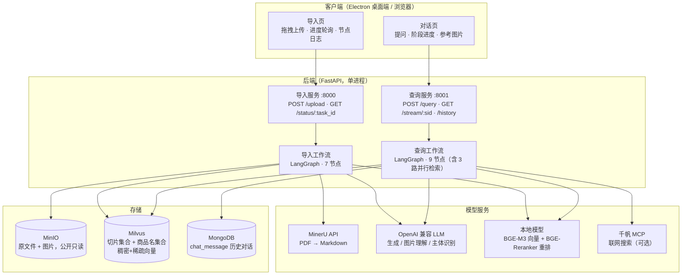
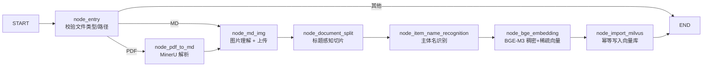
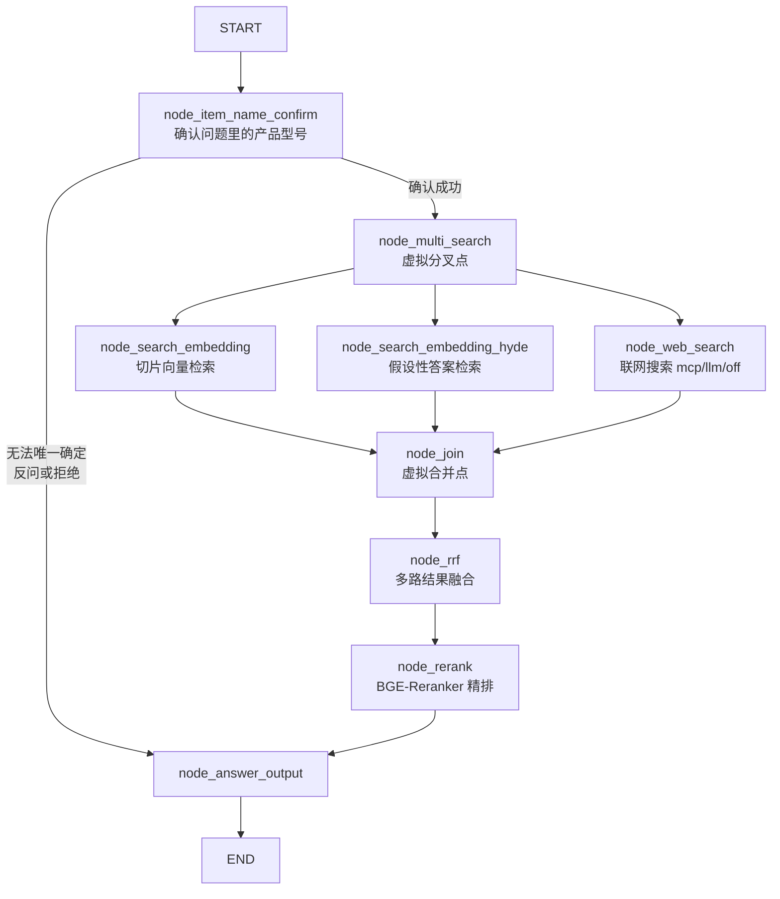

# AiTinkTank · 企业知识库 RAG 问答系统

把企业的产品手册（PDF / Markdown）解析、切分、向量化后建库，再基于「向量检索 + 关键词稀疏检索 + 联网搜索」混合召回，
由大模型生成带图片引用的中文答案；同时提供一条完整的**文件导入流水线**和两个前端（网页版 + 桌面客户端）。

| 组成 | 技术栈 | 位置 | 说明 |
| --- | --- | --- | --- |
| 后端 · 导入服务 | FastAPI + LangGraph | [`backend/`](backend/) | `:8000`，上传文件并跑导入流水线，提供任务进度轮询 |
| 后端 · 查询服务 | FastAPI + LangGraph | [`backend/`](backend/) | `:8001`，问题改写/主体确认 → 混合检索 → 重排 → 生成答案（支持 SSE 流式） |
| 客户端 · 桌面端 | Electron 44 + React 19 + TypeScript + zustand | [`front/`](front/) | 单窗口双视图：对话页 + 导入页，含打包安装程序 |
| 网页版（旧） | 原生 HTML/CSS/JS | `backend/web/page/` | 迁移前的实现，后端仍通过静态挂载提供，保留可用 |

> 子模块文档：**[backend/README.md](backend/README.md)**（流水线与模块）、**[front/README.md](front/README.md)**（客户端与打包）。

---

## 1. 整体架构




**两条流水线的关系**：导入流水线负责“把资料变成可检索的向量”，查询流水线负责“把问题变成有依据的答案”。
两者共用 Milvus（切片集合 / 商品名集合）、MinIO（图片）与同一份 `.env` 配置。

---

## 2. 目录结构

```
AiTinkTank/
├── backend/                     # FastAPI + LangGraph 后端
│   ├── config/                  # 各外部依赖的连接配置（Milvus/MinIO/Mongo/MinerU/LLM/MCP…）
│   ├── processor/
│   │   ├── import_processor/    # 导入流水线（LangGraph 图 + 7 个节点）
│   │   │   ├── main_graph.py    #   图结构：节点注册、条件路由、编译执行
│   │   │   ├── config.py        #   导入相关配置（切片长度等）
│   │   │   ├── state.py         #   图的 state 定义
│   │   │   └── nodes/           #   node_entry / pdf_to_md / md_img / document_split /
│   │   │                        #   item_name_recognition / bge_embedding / import_milvus
│   │   └── query_processor/     # 查询流水线（9 个节点，含 3 路并行 + 虚拟分叉/合并节点）
│   │       ├── main_graph.py    #   图结构：条件路由、并行扇出、RRF/重排串联
│   │       ├── state.py
│   │       ├── nodes/           #   item_name_confirm / search_embedding / search_embedding_hyde /
│   │       │                    #   web_search / rrf / rerank / answer_output
│   │       └── prompt/          #   各节点的提示词（含答案格式与【图片】标记约定）
│   ├── tool/logger.py           # colorlog 控制台日志
│   ├── utils/                   # Milvus / MinIO / Mongo / 向量 / 重排 / SSE / 任务状态 工具
│   ├── web/
│   │   ├── api/
│   │   │   ├── import_service.py   # 导入服务（:8000）
│   │   │   └── query_service.py    # 查询服务（:8001）
│   │   └── page/                   # 网页版前端（chat.html / import.html）
│   ├── doc/                     # 样例语料（PDF，本地目录，未入库）
│   ├── out/                     # 导入落盘结果（按日期/任务分目录，未入库）
│   ├── test/                    # 手工验证脚本（未入库）
│   ├── .env.example             # 配置模板（所有可配项都有注释）
│   ├── pyproject.toml           # 依赖清单（用 uv 管理）
│   └── uv.lock
├── front/                       # Electron + React 桌面客户端
│   ├── src/main/                # 主进程（窗口、外链交给系统浏览器）
│   ├── src/preload/             # contextBridge 暴露 electronAPI
│   ├── src/renderer/src/        # 渲染层：components / stores(zustand) / api / utils
│   ├── build/                   # 打包资源目录（应用图标放这里）
│   ├── electron-builder.yml     # 打包配置（含 NSIS 安装目录选择）
│   ├── .npmrc                   # pnpm 配置 + Electron/打包工具镜像
│   └── pnpm-workspace.yaml      # pnpm 10 的 onlyBuiltDependencies 设置
└── README.md                    # 本文件
```

---

## 3. 环境要求

| 依赖 | 版本 / 说明 |
| --- | --- |
| Python | ≥ 3.11（本机验证 3.11.15），依赖用 [uv](https://docs.astral.sh/uv/) 管理 |
| Node.js | ≥ 20（本机 24.9），包管理器用 pnpm 10.34.5（见 `front/packageManager`） |
| Milvus | 2.x 单机版即可，脚本会自行建集合与索引 |
| MinIO | 任意版本；启动时自动建桶并设置为**公开只读**，前端才能直接加载图片 |
| MongoDB | 存历史对话（库名可配，本机用 `kb001`） |
| GPU（可选） | BGE-M3 / BGE-Reranker 默认跑 `cuda:0`；没有 GPU 就把 `BGE_DEVICE`、`BGE_RERANKER_DEVICE` 改成 `cpu` |
| 外部 API | MinerU（PDF 解析）、OpenAI 兼容 LLM（生成/图片理解/主体识别）、千帆 MCP（联网，可关） |

> Milvus / MinIO / MongoDB 的 Docker 部署命令、本地模型准备清单见文末 **[附录 13](#13-附录)**。

---

## 4. 快速开始

### 4.1 后端

```bash
cd backend

# 1) 安装依赖（pyproject 里 torch 走 NVIDIA 源，按需换 cu118/cu121）
uv sync
#    如需单独装 GPU 版 torch：
#    uv pip install torch torchvision torchaudio --index-url https://download.pytorch.org/whl/cu118

# 2) 配置环境变量
cp .env.example .env       # Windows: copy .env.example .env
#    然后按注释填：Milvus / MinIO / MongoDB / LLM / MinerU / 千帆 MCP，
#    以及本地 BGE 模型的路径与设备

# 3) 启动两个服务（建议开两个终端；顺序无所谓，但客户端需要它们都起着）
python web/api/import_service.py    # 导入服务  http://127.0.0.1:8000
python web/api/query_service.py     # 查询服务  http://127.0.0.1:8001
```

- 服务启动时查询服务会**后台预热本地模型**（BGE-M3 + Reranker），第一次提问因此不会卡在加载模型上；预热失败不影响服务可用。
- 两个服务默认只监听 `127.0.0.1`。要让局域网其他机器访问，把它们改成 `host="0.0.0.0"`，或用
  `uvicorn web.api.query_service:app --host 0.0.0.0 --port 8001` 启动。
- `.env` 放在 `backend/` 下即可，从任何目录启动都会被加载（`python-dotenv` 从调用文件向上查找）。
- 相对路径配置（如 `DATA_BASED_ROOT_DIR=./out`）**一律以 `backend/` 为基准**，不受启动目录影响。

### 4.2 桌面客户端

```bash
cd front
pnpm install

pnpm run dev        # 开发：Vite dev server + Electron（渲染层热更新）
pnpm run build:win  # 打 Windows 安装包（产物在 front/dist/）
```

客户端默认连本机 `127.0.0.1:8001`（查询）与 `127.0.0.1:8000`（导入），
连远端后端时在应用内「设置」里改主机名/端口即可（会持久化）。

### 4.3 先用网页版验证后端

```bash
# 浏览器打开（后端自带静态页面，不依赖 Node）
http://127.0.0.1:8000/import.html    # 导入页
http://127.0.0.1:8001/chat.html      # 对话页
```

---

## 5. 端口与接口一览

| 服务 | 端口 | 方法与路径 | 作用 |
| --- | --- | --- | --- |
| 导入服务 | 8000 | `POST /upload` | `multipart/form-data` 多文件上传（PDF/MD），返回 `task_ids`，随后台任务跑图 |
| | | `GET /status/{task_id}` | 轮询任务状态：`status` / `done_list` / `running_list` / `error`（未知 task_id 返回空状态且不落库） |
| | | `GET /import.html` | 网页版导入页（`/` 会重定向到这里） |
| 查询服务 | 8001 | `POST /query` | 提问。`is_stream=false` 同步返回答案；`is_stream=true` 立刻返回 `session_id`，答案走 SSE |
| | | `GET /stream/{session_id}` | SSE 推送：`ready` / `progress` / `delta` / `final` / `final_answer` / `error` |
| | | `GET /history/{session_id}?limit=50` | 拉取历史对话（含 `image_urls`，刷新后图片不丢） |
| | | `DELETE /history/{session_id}` | 清空该会话历史 |
| | | `GET /health` | 存活探测（客户端顶栏的「API: 已连接」用它） |
| | | `GET /chat.html` | 网页版对话页（`/` 会重定向到这里） |
| | | `GET /docs` | FastAPI 自动生成的 Swagger 文档 |

**请求字段注意**：`POST /query` 支持单次覆盖联网实现，方便 A/B 对比而无需重启：

```json
{ "query": "如何使用万用表测量电压？", "session_id": "sess-xxx", "is_stream": true, "web_search_provider": "llm" }
```

---

## 6. 两条流水线

### 6.1 导入流水线（`processor/import_processor`）

`node_entry` 按文件类型分流：PDF → 先转 Markdown；已是 Markdown → 直接进图片处理；其他类型直接结束。



| 节点 | 做了什么 | 落地产物 |
| --- | --- | --- |
| `node_entry` | 校验文件存在、扩展名，决定走 PDF 还是 MD 分支 | — |
| `node_pdf_to_md` | 调 MinerU API 把 PDF 解析成 Markdown（含图片、表格） | `<data_root>/YYYYMMDD/<task_id>/<文件名>_result.zip` 及解压目录 |
| `node_md_img` | 用视觉模型给每张图生成摘要，上传 MinIO，并把 Markdown 里的图片链接替换成 MinIO 公开 URL | MinIO：`<MINIO_IMG_DIR>/<文档名>/<图片>` |
| `node_document_split` | 按标题层级切分，控制切片长度、合并过短片段、保留句子重叠 | — |
| `node_item_name_recognition` | 用 LLM 从切片里识别「商品/产品名」，作为后续过滤与幂等键 | Milvus 商品名集合 |
| `node_bge_embedding` | BGE-M3 批量生成**稠密向量 + 稀疏向量**（混合检索的基础） | — |
| `node_import_milvus` | 按 `file_title` 清理旧数据后写入切片集合（重复导入同一文件不会产生重复切片） | Milvus 切片集合 |

导入阶段的进度会写入内存任务表（`utils/task_utils.py`），`GET /status/{task_id}` 轮询时把节点名翻成中文展示；
客户端进度条口径：上传占 0~20%，7 个节点占 20~95%，完成 100%。

### 6.2 查询流水线（`processor/query_processor`）



- **主体确认（`node_item_name_confirm`）**：读最近 10 条历史对话理解上下文，识别用户问的是哪个产品。
  若库里有多个候选型号 → 反问用户选哪个；若库里根本没有 → 直接回复找不到；这两种情况都会把答案写进 state，
  条件路由直接跳到答案生成，**不再浪费一次检索**。同时它负责把用户提问写入历史。
- **三路并行检索**：
  - 切片向量检索：问题向量在切片集合里做稠密+稀疏混合检索；
  - HyDE：先让模型编一份“假设性答案”，再用它去检索，缓解口语化提问的语义鸿沟；
  - 联网搜索：`mcp`（千帆 MCP）/ `llm`（大模型自带联网工具）/ `off`，可用环境变量或单次请求切换。
- **融合与精排**：先对**两路向量召回**做 RRF 融合（`score += weight/(k+rank)`，`k=60`），
  然后与**联网搜索结果**一起送进重排节点 —— 网络结果不参与 RRF，而是在这一步与本地结果合并、统一打分。
  重排用本地 BGE-Reranker，之后做两级截断：先按绝对相关性下限（`RERANK_MIN_SCORE=0.3`）丢掉无关文档，
  再做**断崖检测**（相邻分数绝对差 ≥0.5 或相对差 ≥25% 就截断），最终保留 3~10 条作为答案上下文。
  具体参数见 [backend/README.md](backend/README.md) 的「检索参数与阈值」。
- **答案生成（`node_answer_output`）**：只依据检索到的上下文回答，答案会以 `【图片】` 标记结尾，
  后面每行一个图片 URL（前端据此渲染参考图片）；检索不到资料时按配置决定是“如实说没有”还是“用通用知识兜底并显著标注”。

---

## 7. 数据模型

### 7.1 Milvus

| 集合 | 字段 | 说明 |
| --- | --- | --- |
| 切片集合（`CHUNKS_COLLECTION`） | `chunk_id`(PK,自增) `content` `title` `parent_title` `part` `file_title` `item_name` `sparse_vector` `dense_vector` | `dense_vector` 维度**取真实向量长度**（BGE-M3 = 1024）；稠密用 `AUTOINDEX`+`COSINE`，稀疏用 `SPARSE_INVERTED_INDEX`+`IP`（归一化后内积≈余弦） |
| 商品名集合（`ITEM_NAME_COLLECTION`） | `pk`(PK,自增) `file_title` `item_name` `dense_vector`(1024) `sparse_vector` | 导入时按 `item_name` 先删后插保证幂等；查询时用于主体确认 |

### 7.2 MinIO

- 启动时自动建桶，并设置为**公开只读**（前端/客户端可直接用 URL 加载图片，无需预签名）。
- 原文件：`pdf_files/YYYYMMDD/<task_id>/<文件名>`；文档内图片：`<MINIO_IMG_DIR>/<文档名>/<图片文件>`。
- 图片 URL 形如 `http://<MINIO_ENDPOINT>/<BUCKET>/<对象名>`。

### 7.3 MongoDB

- 库名 `MONGO_DB_NAME`，集合 `chat_message`，复合索引 `(session_id ↑, ts ↓)`。
- 文档字段：`session_id` / `role`（`user` 或 `assistant`）/ `text` / `rewritten_query` / `item_names` / `image_urls` / `ts`。
- 这一份数据同时承担两个职责：`/history` 接口的数据源，以及下一轮提问时给模型的历史上下文。

### 7.4 本地落盘

`DATA_BASED_ROOT_DIR`（默认 `backend/out`）下按 `YYYYMMDD/<task_id>/` 分目录保存上传的原文件与 MinerU 解析结果。
这个目录只用于排查与复用，知识库的真正“记忆”在 Milvus 里。

---

## 8. 配置说明

所有配置都走 `backend/.env`，模板见 **`backend/.env.example`**（每个键都有中文注释）。分组概览：

| 分组 | 关键键 | 说明 |
| --- | --- | --- |
| MinerU | `MINERU_API_TOKEN` `MINERU_BASE_URL` `MINERU_MODEL_SOURCE` `MODELSCOPE_OFFLINE` | PDF 解析服务与模型来源 |
| MinIO | `MINIO_ENDPOINT` `MINIO_ACCESS_KEY` `MINIO_SECRET_KEY` `MINIO_BUCKET_NAME` `MINIO_IMG_DIR` | 对象存储；`img_dir` 不配会出现 `None/` 这种坏路径 |
| Milvus | `MILVUS_URL` `CHUNKS_COLLECTION` `ITEM_NAME_COLLECTION` `MILVUS_METRIC_TYPE` `MILVUS_MIN_COSINE_SCORE` | 向量库地址与集合名、相似度阈值 |
| MongoDB | `MONGO_URL` `MONGO_DB_NAME` | 历史对话 |
| LLM | `OPENAI_API_KEY` `OPENAI_BASE_URL` `LLM_DEFAULT_MODEL` `VL_MODEL` `ITEM_MODEL` `LLM_DEFAULT_TEMPERATURE` `LLM_ENABLE_THINKING`(可选) | 兼容 OpenAI 协议；`VL_MODEL` 用于图片理解，`ITEM_MODEL` 用于主体识别；`LLM_ENABLE_THINKING` 只在 Qwen3/DashScope 上需要，留空则不下发该参数 |
| 本地模型 | `BGE_M3_PATH` `BGE_M3` `BGE_DEVICE` `BGE_FP16` `BGE_RERANKER_LARGE` `BGE_RERANKER_DEVICE` `BGE_RERANKER_FP16` `BGE_RERANKER_BATCH_SIZE` `BGE_RERANKER_NORMALIZE` | BGE-M3 / BGE-Reranker；显存不足时把 `*_DEVICE` 改 `cpu`、调小批大小 |
| 联网搜索 | `WEB_SEARCH_PROVIDER` `WEB_SEARCH_LLM_MODEL` `WEB_SEARCH_LLM_TOOL_TYPE` `WEB_SEARCH_MAX_RESULTS` `MCP_API_KEY` `MCP_BASE_URL` | `mcp` / `llm` / `off`，单次请求可覆盖 |
| 路径 | `DATA_BASED_ROOT_DIR` `MODELSCOPE_CACHE` `HF_HOME` | 相对路径以 `backend/` 为基准 |

> **配置里的历史遗留键**（当前代码未读取，保留只为兼容旧 `.env`）：
> `EMBEDDING_MODEL`、`EMBEDDING_DIM`、`MD_ROOT_DIR`、`MILVUS_METRIC_TYPE`、`MILVUS_MIN_COSINE_SCORE`。
> 其中两点最容易误判：`EMBEDDING_DIM` 的注释写着 OpenAI 的 1536 维，但切片集合的实际维度来自 BGE-M3 输出（1024），
> 改它不影响建库；`MILVUS_MIN_COSINE_SCORE` 也不生效，真正起作用的相关性下限是代码里的 `RERANK_MIN_SCORE=0.3`。
> `backend/.env` 里若还有 `RERANK_BASE_URL` / `TEXT_RERANK_MODEL` / `TEXT_RERANK_INSTRUCT` 也属于同类遗留。

---

## 9. 前后端契约（改接口时看这里）

1. **任务状态**：`pending` / `processing` / `completed` / `failed`，节点名由后端翻成中文后再返回。
2. **SSE 事件序列**：`ready` → 多次 `progress` → 多次 `delta` → `final`（或 `final_answer`）；
   出错时发 `error`。服务端推完 `final` 会主动关闭连接，**浏览器随后还会补一个原生 `error` 事件**，
   客户端必须用「是否已收到终结事件」来区分“正常收尾断开”和“真的中断”，否则会把渲染好的答案污染成错误。
3. **流式与非流式**：`is_stream=false` 时 `/query` 同步返回 `answer` + `image_urls` + `error` + `done_list`；
   `is_stream=true` 时 `/query` 只返回 `session_id`，最终答案以 `final` 事件里的 `answer` 为准
   （`delta` 增量里没有图片段）。
4. **答案格式**：正文之后可跟 `【图片】` 标记，标记后面每行一个图片 URL；接口另外回一个 `image_urls` 候选数组。
   客户端渲染时取两者并集，正文里显示时去掉标记段。
5. **上传**：`POST /upload` 返回的 `task_ids` 与文件顺序一一对应，客户端逐个文件轮询 `/status`。

---

## 10. 打包与分发（桌面端）

```bash
cd front
pnpm run build:win      # Windows 安装程序 → front/dist/tinkTank-1.0.0-setup.exe
pnpm run build:unpack   # 只出免安装目录 → front/dist/win-unpacked/
pnpm run build:mac      # 需要在 macOS 上跑
pnpm run build:linux    # 建议在 Linux / Docker 里跑
```

- **安装程序可选安装目录**：靠 `electron-builder.yml` 里 `nsis.oneClick: false` +
  `nsis.allowToChangeInstallationDirectory: true`（两个都要给，缺一个就不会出现目录选择页）。
- **应用图标**：放 `front/build/icon.ico`（≥256×256，Windows）/`icon.icns`（macOS）/`icon.png`（Linux，≥512×512）；
  当前仓库里只有 Windows 的 `icon.ico`，缺哪个平台就退回 Electron 默认图标（只有一条警告，仍能出包）。
  注意运行时窗口图标是另一个文件：`front/resources/icon.png`。
- **macOS 权限声明**：当前没指定 `mac.entitlementsInherit`，用 electron-builder 自带模板；
  该键是显式路径且不做存在性检查，指向不存在的 `build/entitlements.mac.plist` 会让 mac 签名直接失败。
- **国内网络**：Electron 运行时与 winCodeSign/nsis 等打包工具都要从网上拉。镜像已写在 `front/.npmrc`
  （`electron_mirror` + `electron_builder_binaries_mirror`），用 `pnpm run build:win` 会自动生效。

---

## 11. 常见问题

| 现象 | 原因 / 处理 |
| --- | --- |
| 客户端顶栏「API: 未连接」 | 查询服务没起或端口/主机名不对（应用内「设置」可改）。客户端每 5 秒探测一次 `/health` |
| 导入页「导入服务：未连接」 | 导入服务（`:8000`）没起；导入服务的存活探测用的是 `GET /status/__probe__`（后端对未知 task_id 返回空状态且不落库） |
| 图片在客户端里加载不出来 | MinIO 桶不是公开只读，或客户端所在网络访问不到 `MINIO_ENDPOINT`（URL 是后端拼好后返回的直链） |
| 第一次提问很慢 | 本地模型冷启动。服务启动时已后台预热；仍慢就确认 `BGE_*_DEVICE` 是否误配成 `cpu` |
| `milvus` 报维度不匹配 | 集合是早前用别的向量模型建的。删掉集合重新导入即可（建集合时会按真实向量长度建） |
| 打包卡在下载 / `connect ETIMEDOUT` 到 github | 走 `.npmrc` 里的镜像，用 `pnpm run build:win`（详见第 10 节） |
| `pnpm dev` 启动 Electron 时报 `Cannot read properties of undefined (reading 'isPackaged')` | 环境里被注入了 `ELECTRON_RUN_AS_NODE`（Electron 会退化成纯 Node 跑，`require('electron').app` 就没了）。`front/scripts/run.mjs` 已尝试清除；若仍复现，在启动前手动 `set ELECTRON_RUN_AS_NODE=`（PowerShell：`Remove-Item Env:ELECTRON_RUN_AS_NODE`） |
| `import flagembedding` 报错 | 包名是 `FlagEmbedding`（大写 F），不要用小写导入 |

---

## 12. 已知问题 / 待办

- 后端注入的进度与结果状态存在**进程内存**里（`utils/task_utils.py`），因此两个服务必须**单进程**运行；
  重启后旧 task_id 会查不到（客户端已有对应提示）。多副本部署需要改成 Redis 之类的共享存储。
- `backend/doc/`（样例 PDF 语料）与 `backend/test/`（手工验证脚本）在 `.gitignore` 里，**不在仓库中**，
  克隆后需要自备语料；`backend/out/` 是导入落盘目录，同样未入库。
- `backend/web/api/test.py` 与 `utils/mongo_history_utils.py` 底部的 `__main__` 块是调试用代码，不是正式入口。
- 配置里存在未使用的历史键（见第 8 节），`ImportConfig.embedding_dim` 字段也未被任何节点读取。
- macOS 未配置签名与公证（`notarize: false`），仅适合内部使用；Linux 的 `snap` 目标需要本机装 snapcraft。
- 客户端与后端之间**没有鉴权**，只适合本机或内网使用；对外暴露需要自行加网关与令牌校验。
- 联网搜索的 `llm` 实现依赖大模型厂商的联网工具（当前按 OpenAI Responses 的 `web_search` 配置），
  换供应商时需要同步调整 `WEB_SEARCH_LLM_TOOL_TYPE`。

---

## 13. 附录

### 13.1 中间件部署（Docker 速查）

三个中间件都可以用 Docker 起，起完把地址填进 `backend/.env` 即可。部署命令见下方，逐个说明：

**MinIO —— 对象存储（9000 是 API，9001 是控制台）**

```bash
docker run -d --name minio --restart always \
  -p 9000:9000 -p 9001:9001 \
  -e "MINIO_ROOT_USER=minioadmin" -e "MINIO_ROOT_PASSWORD=minioadmin" \
  -v "$(pwd)/volumes/minio/data:/data" \
  quay.io/minio/minio:RELEASE.2024-12-18T13-15-44Z server /data --console-address ":9001"
```

- 建议锁定上面这个 tag：之后的 MinIO 社区版把桶策略等控制台功能挪进了企业版。
- **桶不用手工创建**：服务启动时会自动建桶并设置成公开只读（前端要能直接按 URL 加载图片）。
- `.env` 对应项：`MINIO_ENDPOINT=<ip>:9000`（**不要带 `http://`**）、`MINIO_ACCESS_KEY`、`MINIO_SECRET_KEY`、`MINIO_BUCKET_NAME`、`MINIO_IMG_DIR`。
- 控制台：`http://<ip>:9001`（默认 minioadmin / minioadmin，生产环境务必改）。

**Milvus —— 向量库（19530）**

```bash
wget https://github.com/milvus-io/milvus/releases/download/v2.5.5/milvus-standalone-docker-compose.yml -O docker-compose.yml
docker compose up -d
docker compose ps
```

- 单机版会一并启动 etcd 和 Milvus 自带的 MinIO；**如果本机已经跑了一个 MinIO，要改 compose 里的宿主端口**，否则 9000 冲突。
- 想要可视化界面可以再挂一个 Attu 容器（默认 7000 端口）连到 `milvus-standalone:19530`。
- `.env` 对应项：`MILVUS_URL=http://<ip>:19530`、`CHUNKS_COLLECTION`、`ITEM_NAME_COLLECTION`；
  集合与索引由导入节点首次写入时自动创建，不用手工建表。
- 排查：`docker compose logs milvus-standalone`；重建：`docker compose down --volumes --remove-orphans`。

**MongoDB —— 历史对话（27017）**

```bash
docker run -d --name mongo --restart always -p 27017:27017 mongo
```

- `.env` 对应项：`MONGO_URL=mongodb://<ip>:27017`、`MONGO_DB_NAME=kb001`；集合 `chat_message` 与索引由代码自动创建。
- 图形化客户端可用 MongoDB Compass 连 `mongodb://localhost:27017`。

### 13.2 本地模型准备

两条流水线都要用下面两个本地模型，缺了会在对应节点直接报错：

| 模型 | 用途 | 相关配置 | 说明 |
| --- | --- | --- | --- |
| `BAAI/bge-m3` | 稠密 + 稀疏向量（稠密 1024 维） | `BGE_M3_PATH`、`BGE_M3`、`BGE_DEVICE`、`BGE_FP16` | 导入的向量化节点、查询的两路向量检索都用它 |
| `BAAI/bge-reranker-large` | Cross-Encoder 精排 | `BGE_RERANKER_LARGE`、`BGE_RERANKER_DEVICE`、`BGE_RERANKER_FP16`、`BGE_RERANKER_BATCH_SIZE` | 重排节点用；显存不足时调小批大小 |

- 把 `*_PATH` 指到本地模型目录，配合 `MODELSCOPE_CACHE` / `HF_HOME` 与 `MODELSCOPE_OFFLINE=1` 即可离线加载。
- 没有 GPU：`BGE_DEVICE=cpu`、`BGE_RERANKER_DEVICE=cpu`（会明显变慢，功能正常）。
- 首次提问变慢基本都是模型冷启动；查询服务启动时会开后台线程预热这两个模型。

### 13.3 名词速查

| 名词 | 在本项目里的含义 |
| --- | --- |
| RAG | 检索增强生成：先从知识库检索资料，再让模型只依据资料作答 |
| 切片 / chunk | 文档切分后的最小检索单位，附带 `title` / `parent_title` / `part` 等定位信息 |
| 混合检索 | 稠密向量（语义）+ 稀疏向量（关键词）同时召回，再用 `WeightedRanker` 加权融合（本项目 0.8 / 0.2） |
| HyDE | Hypothetical Document Embeddings：先让模型写一份“假设性答案”，再用它去检索，改善口语化提问的召回 |
| RRF | Reciprocal Rank Fusion：按**排名**而非分数融合多路结果，规避不同来源分数量级不可比的问题 |
| Rerank | 用 Cross-Encoder 对候选逐条精排；本项目还叠加“断崖检测”动态截断，避免带进弱相关切片 |
| 主体识别 / 产品确认 | 判断“问的是哪个产品”，查询时用它按 `item_name` 过滤切片 |

### 13.4 环境变量的一个坑

`load_dotenv()` 默认**不覆盖**已存在的系统环境变量。若系统里已经设过同名变量（例如全局配过 `OPENAI_API_KEY`），
`backend/.env` 里的值不会生效——排查“配置改了没反应”时先确认这一条。
