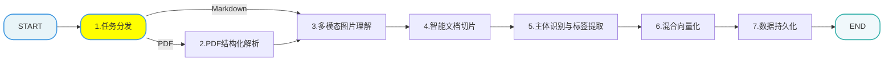
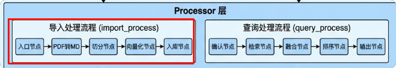
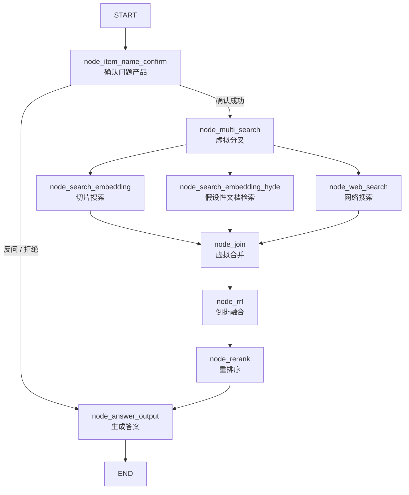

# backend · RAG 后端服务

FastAPI 暴露两个服务，业务逻辑由两条 **LangGraph** 流水线承担：

| 服务 | 入口 | 端口 | 职责 |
| --- | --- | --- | --- |
| 导入服务 | `web/api/import_service.py` | 8000 | 上传文件 → 落盘 / MinIO → 后台跑导入图 → 提供任务进度轮询 |
| 查询服务 | `web/api/query_service.py` | 8001 | 提问 → 后台跑查询图 → 同步返回或 SSE 流式返回 → 历史记录读写 |

完整的接口清单、前后端契约、部署与排错见仓库根目录的 [README.md](../README.md)；本文档聚焦后端内部结构。

---

## 1. 模块结构

```
backend/
├── config/                  # 外部依赖的连接配置（每个文件一个依赖，读环境变量 → 冻结的 dataclass）
│   ├── embedding_config.py  #   BGE-M3（本地向量模型）
│   ├── reranker_config.py   #   BGE-Reranker（本地重排模型）
│   ├── lm_config.py         #   OpenAI 兼容 LLM（生成 / 图片理解 / 主体识别）
│   ├── milvus_config.py     #   Milvus 地址与集合名
│   ├── minio_config.py      #   MinIO 连接与图片目录
│   ├── mineru_config.py     #   MinerU 解析服务
│   ├── mcp_config.py        #   千帆 MCP 联网搜索
│   ├── web_search_config.py #   联网实现的开关与参数
│   └── path_config.py       #   路径解析（相对路径统一以 backend/ 为基准）
├── processor/
│   ├── import_processor/    # 导入流水线
│   │   ├── main_graph.py    #   图：注册节点 + 条件路由 + 编译执行
│   │   ├── config.py        #   切片长度等参数
│   │   ├── state.py         #   图 state（get_default_state 给全字段兜底）
│   │   ├── base.py          #   节点基类（统一日志 / 进度上报）
│   │   ├── exceptions.py
│   │   └── nodes/           #   7 个业务节点
│   └── query_processor/     # 查询流水线
│       ├── main_graph.py    #   图：条件路由 + 3 路并行扇出 + 虚拟合并
│       ├── state.py
│       ├── nodes/           #   7 个业务节点 + 2 个虚拟节点
│       └── prompt/          #   提示词与答案格式约定（含【图片】标记）
├── tool/logger.py           # colorlog 彩色控制台日志（只输出到 stdout，不写文件）
├── utils/
│   ├── milvus_utils.py      # Milvus 客户端单例 + 混合检索
│   ├── minio_utils.py       # MinIO 客户端单例（建桶 + 公开只读策略）
│   ├── mongo_history_utils.py  # 历史对话读写（chat_message 集合）
│   ├── embedding_utils.py   # BGE-M3 单例与批量编码
│   ├── reranker_utils.py    # BGE-Reranker 单例与精排
│   ├── llm_utils.py         # LLM 客户端封装
│   ├── sse_utils.py         # SSE 队列与事件打包
│   ├── task_utils.py        # 内存任务表（状态 / 节点进度 / 结果）+ 节点名中文映射
│   └── json_format_utils.py
└── web/
    ├── api/                 # 两个 FastAPI 应用
    └── page/                # 网页版前端（chat.html / import.html + css/js）
```

---

## 2. 导入流水线（`processor/import_processor`）

导入链路的业务节点：





### 2.1 节点与实现

| 节点文件 | 图中编号 | 做什么 | 关键实现点 |
| --- | --- | --- | --- |
| `node_entry.py` | 1 任务分发 | 校验文件存在性与扩展名，决定走 PDF 还是 Markdown 分支，并把任务信息写进 state | 条件路由函数 `route_after_entry` 三分支：`node_pdf_to_md` / `node_md_img` / `END`（不支持的格式直接结束，不浪费后续步骤） |
| `node_pdf_to_md.py` | 2 PDF 结构化解析 | 调 MinerU 把 PDF 转成 Markdown（保留标题层级、表格、图片） | 结果落盘到 `<DATA_BASED_ROOT_DIR>/YYYYMMDD/<task_id>/`；MinerU 的能力见下方说明 |
| `node_md_img.py` | 3 多模态图片理解 | 逐张图片先用视觉模型生成摘要，再上传 MinIO，最后把 Markdown 里的图片链接替换成 MinIO 公开 URL | 摘要结论会作为图片的说明文字写回 Markdown（``），因此答案里的图片是"带解释"的；上传目录 `<MINIO_IMG_DIR>/<文档名>/` |
| `node_document_split.py` | 4 智能文档切片 | 按标题层级切分正文，控制单片长度、合并过短片段、保留句子重叠 | 参数在 `config.py`：`max_content_length=2000`、`min_content_length=500`、`overlap_sentences=1`；同时保留 `title` / `parent_title` / `part` 供检索时定位 |
| `node_item_name_recognition.py` | 5 主体识别与标签提取 | 让 LLM 从切片中识别"这份资料讲的是哪个产品/型号"，写入商品名集合，并作为切片去重的幂等键 | 集合不存在时按固定 1024 维（BGE-M3 稠密维度）建表；写入前先按 `item_name` 删除旧数据，保证同一产品重复导入不产生脏数据 |
| `node_bge_embedding.py` | 6 混合向量化 | 用 BGE-M3 批量编码，一次同时产出**稠密向量**和**稀疏向量** | 稀疏向量承载关键词/术语匹配能力，与稠密向量一起构成混合检索的基础 |
| `node_import_milvus.py` | 7 数据持久化 | 建集合（首次）、按 `file_title` 清理旧切片、批量写入 | **维度取自真实向量长度**（`len(dense_vector)`），不读 `EMBEDDING_DIM`，因此换向量模型也不会写错维度；稠密 `AUTOINDEX`+`COSINE`，稀疏 `SPARSE_INVERTED_INDEX`+`IP` |

**MinerU** 能把非结构化 / 弱结构化文档（PDF、Word、PPT、Excel、图片、网页 URL 等）解析为机器可读的
Markdown / JSON / LaTeX / HTML。本项目只用它的 PDF → Markdown 能力，通过 API 调用（`MINERU_API_TOKEN`、`MINERU_BASE_URL`）。

### 2.2 进度上报

每个节点执行时通过 `utils/task_utils.py` 更新内存任务表：

- `add_running_task(task_id, node_name)` → `/status` 的 `running_list`
- `add_done_task(task_id, node_name)` → `/status` 的 `done_list`（会自动把同名节点从 running 里摘掉）
- 节点名在返回前统一翻成中文（映射表在 `task_utils._NODE_NAME_TO_CN`）

上传阶段额外标记了一个伪节点 `upload_file`（开始上传文件），所以前端一共能看到 **8 个进度步**：
`upload_file` + 图中 7 个节点。

---

## 3. 查询流水线（`processor/query_processor`）



### 3.1 节点说明

| 节点 | 作用 |
| --- | --- |
| `node_item_name_confirm` | 入口节点。读最近 10 条历史理解上下文，确认用户问的具体产品；把用户提问写入历史。**三种结局**：唯一确定 → 继续检索；多个候选 → 生成反问句；库里没有 → 生成拒绝句。后两种把答案直接写进 state，条件路由跳过检索直达答案生成 |
| `node_multi_search` / `node_join` | 虚拟节点（`lambda x: x`）：只做流程上的分叉与合并，无业务逻辑，便于图结构清晰、易于扩展成更多检索路 |
| `node_search_embedding` | 切片向量检索：问题编码后在切片集合做稠密+稀疏混合检索 |
| `node_search_embedding_hyde` | HyDE：先让模型生成一份"假设性答案"，再用它检索，缓解口语化提问与文档措辞之间的语义鸿沟 |
| `node_web_search` | 联网搜索，三种实现由 `WEB_SEARCH_PROVIDER` 或单次请求参数切换：`mcp`（千帆 MCP）/ `llm`（大模型自带联网工具）/ `off` |
| `node_rrf` | 结果融合：用 RRF 公式 `score += weight / (k + rank)`（`k=60`，两路权重都是 1.0）把**两路向量召回**（切片检索 + HyDE 检索）合成一个可比对的排序。**注意：网络搜索结果不参与 RRF**，它在下一个节点与本地结果合并 |
| `node_rerank` | 精排 + 动态截断：先把本地结果与网络结果合并成统一结构（`source=local/web`），再用本地 BGE-Reranker 逐条打分，然后做「绝对相关性下限过滤 → 断崖检测动态截断」（详见 3.3） |
| `node_answer_output` | 生成最终答案：只依据检索到的上下文作答，并负责把答案与图片 URL 写回历史。检索为空时的行为由提示词配置决定（见下） |

### 3.2 答案格式与兜底策略（`prompt/answer_output.py`）

- `IMAGE_MARKER = "【图片】"`：答案正文之后跟这个标记，标记后每行一个图片 URL。**客户端已按该约定解析**，
  同时接口还会单独返回 `image_urls` 候选数组。
- `ALLOW_GENERAL_KNOWLEDGE_ANSWER`：知识库与联网都没检索到资料时，是否允许用模型自身知识作答。
  当前为 `True`，且答案必须带上 `GENERAL_ANSWER_LABEL` 标注（“以下内容来自通用知识，仅供参考”），
  避免用户误以为有企业资料背书；设为 `False` 时直接回复 `NO_CONTEXT_ANSWER`。

### 3.3 检索参数与阈值（改检索效果先看这里）

这些常量直接写在节点/工具代码里，不在 `.env` 中（`.env` 里的 `MILVUS_METRIC_TYPE`、`MILVUS_MIN_COSINE_SCORE` 当前**不生效**）：

| 参数 | 位置 | 当前值 | 作用 |
| --- | --- | --- | --- |
| `ranker_weights` | `node_search_embedding.py` / `node_search_embedding_hyde.py` / `node_item_name_confirm.py` | `(0.8, 0.2)` | Milvus `WeightedRanker` 的稠密/稀疏权重（稀疏偏关键词匹配）。注意该行注释写的“各占50%”是旧值，实际是 0.8/0.2 |
| `limit`（请求侧） | 同上，`create_hybrid_search_requests(limit=10)` | `10` | 单路请求的候选数 |
| `limit`（融合侧） | `utils/milvus_utils.hybrid_search(..., limit=5)` | `5` | WeightedRanker 融合后**实际返回**条数，未显式传参时取默认 5，因此每路最终是 5 条 |
| `k` / 权重 | `node_rrf._rrf_merge` | `60` / 各路 `1.0` | RRF 平滑常数与各路权重 |
| `WEB_SEARCH_MAX_RESULTS` | `.env` | `5` | 联网搜索（`llm` 实现）最多保留的引用条数 |
| `RERANK_MIN_SCORE` | `node_rerank.py` | `0.3` | **绝对相关性下限**：低于它的文档视为“与问题无关”直接丢弃。实测相关问题的 top 分在 0.61~0.99、无关问题 ≤0.12，所以 0.3 能把“有资料/没资料”分开 |
| `RERANK_MIN_TOPK` / `RERANK_MAX_TOPK` | `node_rerank.py` | `3` / `10` | 断崖截断后保留条数的上下界 |
| `RERANK_GAP_ABS` / `RERANK_GAP_RATIO` | `node_rerank.py` | `0.5` / `0.25` | 断崖判定阈值：相邻两条分数的**绝对差 ≥0.5** 或 **相对差 ≥25%** 就认为下一条相关性骤降，截断在当前位置 |

**断崖检测（cliff cutoff）的执行顺序**很关键：先按 `RERANK_MIN_SCORE` 过滤掉无关文档，**再**套“至少保留 N 条”。
反过来的话，`RERANK_MIN_TOPK=3` 会把已经判定为无关的切片又拉回来，导致拿垃圾上下文硬编答案。
过滤后列表为空时，节点返回空列表并记一条“最高分低于相关性下限”，上层据此走“没有可用资料”的分支
（见 3.2 的通用知识兜底策略）。

---

## 4. 启动与调试

```bash
cd backend
uv sync                                   # 安装依赖
cp .env.example .env                      # 填配置

python web/api/import_service.py          # 导入服务 :8000
python web/api/query_service.py           # 查询服务 :8001
```

单独跑某条流水线（调试用，需要 Milvus / MinIO / Mongo / 模型都可用）：

```bash
cd backend
python -m processor.import_processor.main_graph   # 跑一份 PDF 的完整导入（文件路径写在该文件 __main__ 里）
python -m processor.query_processor.main_graph    # 跑一次提问并打印图结构
```

> 必须用 `python -m ...` 从 `backend/` 目录执行：节点里用的是 `from processor.xxx` 这种以 `backend/` 为根的绝对导入。
> `backend/test/` 下有若干手工验证脚本（语音/向量库连通性等），该目录未入库，克隆后需自备。

补充说明：

- **两个服务都是单进程应用**：任务状态、SSE 队列都在进程内存里，不能用 `--workers > 1` 起多副本，
  否则 `/status`、`/stream` 可能落到没有该任务的进程上。
- 日志只输出到控制台（`tool/logger.py`），排查导入失败时看后端终端即可；客户端会同时收到 `error` 事件。
- 查询服务启动时会**后台线程预热本地模型**（BGE-M3 + Reranker），避免第一个问题卡在加载模型上。
- 两个服务都用 CORS `allow_origins=["*"]`（不带凭据），因此桌面客户端 / 网页版跨端口调用都没问题。
- 网页版前端（`web/page/`）由服务通过 `StaticFiles` 静态挂载提供；`/` 分别重定向到
  `/import.html` 与 `/chat.html`。

---

## 5. 配置

配置全部来自 `backend/.env`（模板见 [`.env.example`](.env.example)，每个键都有注释），
分组为：MinerU / MinIO / Milvus / MongoDB / LLM / 本地 BGE 模型 / 联网搜索 / 路径与模型缓存。
完整的键清单与含义见根 README 的「配置说明」一节。

几个容易踩的点：

1. **相对路径以 `backend/` 为基准**（`config/path_config.py`），例如 `DATA_BASED_ROOT_DIR=./out`
   等价于 `backend/out`，无论从哪个目录启动服务都一致。
2. `MINIO_IMG_DIR` 必须配置，否则图片 URL 里会出现 `None/` 这样的坏路径。
3. `BGE_M3_PATH` / `BGE_RERANKER_LARGE` 指本地模型目录；显存不够就把 `BGE_DEVICE`、`BGE_RERANKER_DEVICE`
   改成 `cpu`，并调小 `BGE_RERANKER_BATCH_SIZE`。
4. 以下键是**历史遗留，当前代码不读取**：`EMBEDDING_MODEL`、`EMBEDDING_DIM`、`MD_ROOT_DIR`、
   `MILVUS_METRIC_TYPE`、`MILVUS_MIN_COSINE_SCORE`
   （切片集合维度由 BGE-M3 实际输出决定 = 1024；度量方式与相关性下限写死在代码里）；
   `.env` 里若还有 `RERANK_BASE_URL`、`TEXT_RERANK_MODEL`、`TEXT_RERANK_INSTRUCT` 也属于同类遗留。
5. `ImportConfig`（`processor/import_processor/config.py`）里由环境变量派生的字段
   （`embedding_dim`、`openai_api_base`、`milvus_url`、`minio_*`…）同样**没有被节点使用**：
   节点真正读的是 `config/lm_config.py`、`milvus_config`、`minio_config`。
   其中 `openai_api_base` 读的还是旧键名 `OPENAI_API_BASE`，实际生效的是 `OPENAI_BASE_URL`。
   `ImportConfig` 目前只有切片相关参数（`max_content_length` / `min_content_length` /
   `item_name_chunk_k` / `item_name_chunk_size` / `image_extensions`）在被使用。
6. `LLM_ENABLE_THINKING` 是**可选**键：不设置时不下发该参数（兼容标准 OpenAI 端点）；
   用 Qwen3 / DashScope 时按需设 `0`/`1`（模板里默认注释掉）。
   另外 `ITEM_MODEL` 缺失时会回退到 `LLM_DEFAULT_MODEL`，但 `LLM_DEFAULT_TEMPERATURE` 是必填的
   （代码直接 `float()`，为 None 会抛异常）。

---

## 6. 数据落地

| 位置 | 内容 | 说明 |
| --- | --- | --- |
| `backend/out/YYYYMMDD/<task_id>/` | 上传的原文件、MinerU 的 `_result.zip` 与解压结果 | 目录名 = 任务 id，用于排查与复用；`DATA_BASED_ROOT_DIR` 可改 |
| MinIO | 原始文件 `pdf_files/YYYYMMDD/<task_id>/<文件名>`；文档图片 `<MINIO_IMG_DIR>/<文档名>/<图片>` | 桶策略为公开只读，前端直接用 URL 加载图片 |
| Milvus | 切片集合（内容 + 元数据 + 稠密/稀疏向量）、商品名集合 | 知识库的真正"记忆"，重复导入同一文件会先清旧数据再写入 |
| MongoDB | `chat_message` 集合（历史对话） | 既是 `/history` 的数据源，也是下一轮提问时给模型的历史上下文 |

---

## 7. 待办 / 已知问题

- 任务状态与 SSE 队列都在进程内存，重启即失效（客户端已有"未查询到该任务"的提示）；如需多副本要换共享存储。
- `web/api/test.py`、`utils/mongo_history_utils.py` 底部的 `__main__` 代码块是调试残留，不是正式入口。
- `backend/doc/`（样例 PDF 语料）和 `backend/test/` 未入库，克隆后需自备。
- 未做鉴权：两个服务的接口都是开放的，只适合内网 / 本机使用。
