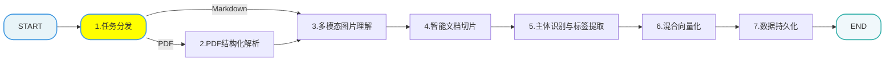

## 1. processor层的import_processor的实现

​	import_processor层各个节点业务：

### 1.1 node_entry.py入口节点实现与单元测试

### 1.2 node_pdf_to_md.py 节点实现

- MinerU:能够将**非结构化或弱结构化文档**（如PDF、Word、PPT、Excel、图片、网页URL等）解析为**机器可读的Markdown、JSON、LaTeX、HTML等格式**
- 

